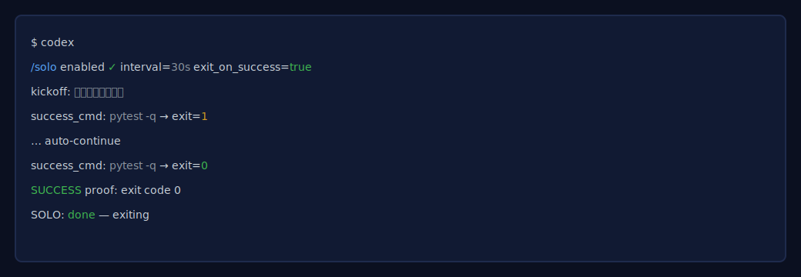

发布下载（最新）：https://github.com/gnusec/codex-solo/releases
入群 / Discussions：https://github.com/gnusec/codex-solo/discussions

语言 / Languages：简体中文（当前） · English · Español · العربية · हिन्दी
- English: docs/README.en.md
- Español: docs/README.es.md
- العربية: docs/README.ar.md
- हिन्दी: docs/README.hi.md

# Codex SOLO

Slogan：独闯天涯，凭证为王；不靠嘴，靠退出码。
作用：自动连击执行，直到“成功检查”以 0 退出码通过，才算完成。

## Quick Demo


## Quick Start
- 构建：`cd vendor/codex/codex-rs && cargo build -p codex-cli --release`
- 运行：`./vendor/codex/codex-rs/target/release/codex`
- 开启 SOLO：在 TUI 输入 `/solo`，或设置环境变量 `CODEX_SOLO_AUTOSTART=1`
- 多实例配置：为不同控制台设置 `CODEX_SOLO_CONFIG=/path/to/solo.json`

## Minimal Config (.codex-solo.json)
```
{
  "kickoff_prompt": "实现并让测试通过",
  "continue_prompt": "继续",
  "success_cmd": ["pytest", "-q"],
  "exit_on_success": true,
  "interval_seconds": 30
}
```

或使用脚本化证明（退出码为 0 代表成功）：
```
{ "success_sh": "test -f FINISH.txt" }
```

## Key Options
- `success_cmd` / `success_sh`：成功由退出码 0 判定
- `done_token`：默认 `[SOLO_DONE]`；设为 "" 可避免引导模型输出标记
- `exit_on_success`：成功后退出 CLI
- `interval_seconds`：自动继续之间的延迟

## Downloads
- 最新发布与校验和：https://github.com/gnusec/codex-solo/releases

## Docs
- 多语言上手：docs/README.en.md · docs/README.zh-CN.md · docs/README.es.md · docs/README.ar.md · docs/README.hi.md
- 深入原理：docs/SOLO.en.md · docs/SOLO.zh-CN.md · docs/SOLO.es.md · docs/SOLO.ar.md · docs/SOLO.hi.md
- 路线图：docs/ROADMAP.md

## 常见场景（Common Scenarios）
- 测试驱动（Python 示例）
  ```json
  {
    "kickoff_prompt": "补全实现并让测试通过",
    "success_cmd": ["pytest", "-q"],
    "continue_prompt": "继续（修到全绿）",
    "exit_on_success": true,
    "interval_seconds": 30
  }
  ```
- 文档构建/发布门禁（MkDocs 示例）
  ```json
  {
    "kickoff_prompt": "完善文档并保证可构建",
    "success_sh": "mkdocs build >/dev/null && test -f site/index.html",
    "continue_prompt": "继续（直到构建产物存在）",
    "exit_on_success": true
  }
  ```
- 代码健康（Rust 示例）
  ```json
  {
    "kickoff_prompt": "修复警告并通过测试",
    "success_sh": "cargo clippy -- -D warnings && cargo fmt -- --check && cargo test -q",
    "continue_prompt": "继续（直到无警告且测试通过）",
    "exit_on_success": true
  }
  ```


## License
见 `LICENSE`
