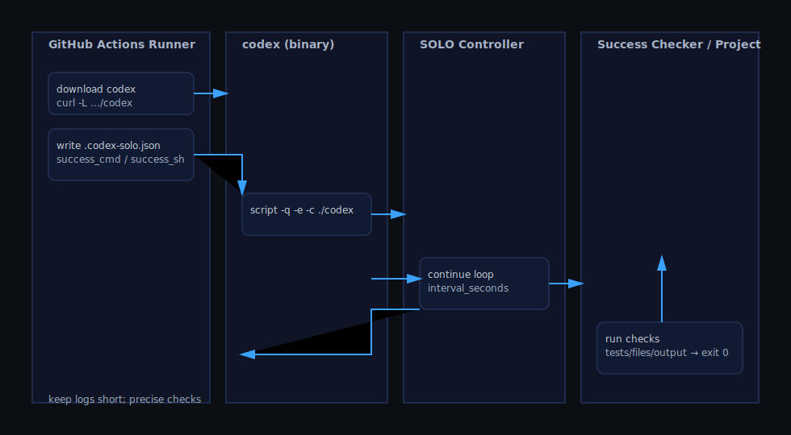

الهندسة والتصميم
=================

يوضح هذا المستند كيف يقوم هذا المستودع بعمل vendor لـ Codex ويضيف وضع SOLO العملي، وكيف تعمل فحوصات النجاح واستخدام CI/الوضع غير التفاعلي.

مخطط

مخطط التسلسل

المكوّنات (تفصيلي)

تسلسل CI

وصفات النجاح (امتدادات)

أمثلة
- JSONPath: `jq -e '.summary.passed==42' report.json >/dev/null`
- HTTP: `curl -fsS http://localhost:8787/healthz >/dev/null`
- Grep: `tool run | tee /tmp/out >/dev/null && grep -q 'All good' /tmp/out`

الأهداف
- تقليل الانحراف عن المصدر الأصلي قدر الإمكان (vendor؛ تجنب التغييرات المتطفلة)
- أتمتة التقدّم بحلقة تلقائية بدل التخمين اليدوي
- تعريف النجاح بالدليل (خروج 0، ملفات/مخرجات/اختبارات) لا بالعبارات

المكوّنات
- واجهة Codex النصية (vendor): واجهة تشغيل تفاعلية
- متحكّم SOLO: حلقة متابعة تلقائية مع `continue_prompt` و `interval_seconds` و `exit_on_success`
- مدقّق النجاح: `done_token` أو فحوصات قابلة للبرمجة عبر `success_cmd` / `success_sh` (خروج 0)
- محمّل الإعدادات: `.codex-solo.json` أو `CODEX_SOLO_CONFIG`
- تعدد المثيلات A/B: Runner (يراقب الدليل) و Judge (ينتج الدليل)
- CI/بدون واجهة (تكامل مستمر): طرفية وهمية (pseudo‑TTY) + تشغيل تلقائي + فحوصات قابلة للبرمجة

تدفق البيانات
1) يفعّل المستخدم SOLO في الواجهة (`/solo`) أو بالتشغيل التلقائي عبر البيئة/الملف
2) يرسل المتحكّم مطالبات متابعة قصيرة؛ مع فترة فاصلة اختيارية
3) بعد كل دورة، يجري مدقّق النجاح: مطابقة العلامة أو أمر/صدفة خارجية تعود بخروج 0
4) إن تحقق النجاح → خروج اختياري؛ وإلا المتابعة

ملاحظات التصميم
- فضّل `success_sh` لأدلّة دقيقة (grep للتقرير، التحقق من JSON/ملف)
- يمكن تعطيل `done_token` بجعله سلسلة فارغة
- A/B: استخدم `CODEX_SOLO_CONFIG` مختلفة لفصل الإعدادات
- بدون واجهة: سجلات موجزة؛ فحوصات قصيرة ودقيقة (تجنّب الضوضاء)

قابلية التوسعة
- إضافة وصفات فحص (مثل JSONPath أو فحوصات HTTP)
- في CI يمكن تنزيل ملف `codex` التنفيذي من الإصدارات
