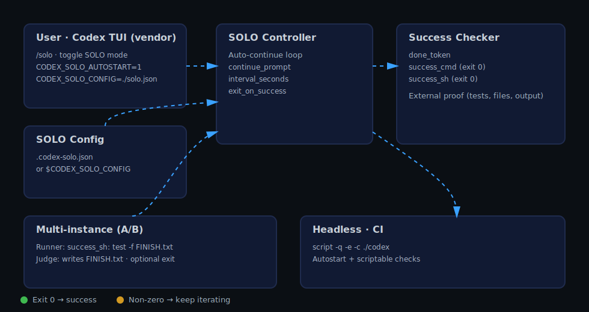
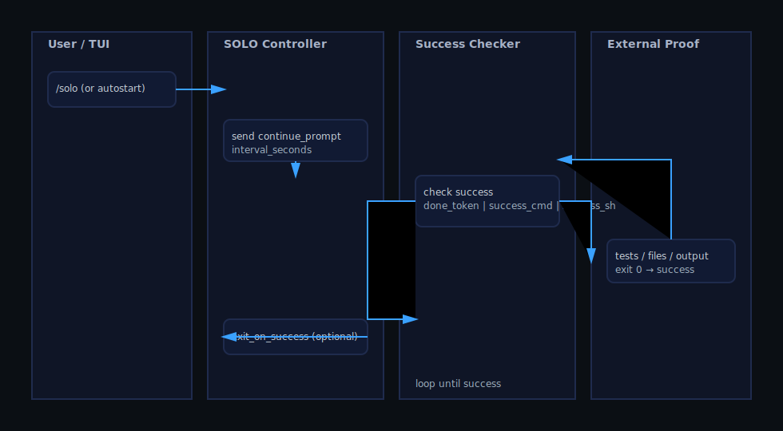
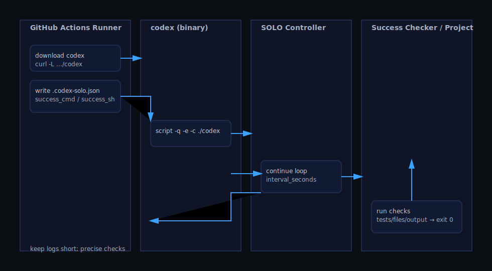

Arquitectura y Diseño
=====================

Este documento explica cómo este repositorio hace vendor de Codex y añade un modo SOLO práctico, además de cómo funcionan las comprobaciones de éxito y el uso en CI/headless.

Diagrama

Secuencia

Componentes (detallado)

Secuencia CI

Objetivos
- Mantener al mínimo la desviación respecto a upstream (vendor de Codex; evitar cambios intrusivos)
- Automatizar el avance con un bucle (no con adivinanzas)
- Definir el éxito por prueba (exit 0, ficheros/salidas/tests), no por redacción

Componentes
- TUI de Codex (vendor): CLI interactiva usada como consola operadora
- Controlador SOLO: bucle de auto‑continuación con `continue_prompt`, `interval_seconds`, `exit_on_success`
- Comprobador de éxito: `done_token` o comprobaciones scriptables vía `success_cmd` / `success_sh` (exit 0)
- Cargador de Config: `.codex-solo.json` o `CODEX_SOLO_CONFIG`
- Multi‑instancia A/B: Runner (vigila la prueba) y Judge (produce la prueba)
- Headless/CI (Integración Continua): seudo‑TTY (pseudoterminal) + autostart + comprobaciones scriptables

Flujo de datos
1) El usuario activa SOLO en la TUI (`/solo`) o autoinicia vía env/archivo
2) El controlador envía prompts de “continuar”; opcionalmente con intervalo
3) Tras cada iteración, el Comprobador de éxito ejecuta: token o comando/shell externo con salida 0
4) Si hay éxito → salida opcional; si no → continuar

Notas de diseño
- Preferir `success_sh` para pruebas precisas (grep del reporte, comprobar JSON/fichero)
- `done_token` puede desactivarse estableciéndolo a cadena vacía
- Multi‑instancia A/B: usar distintos `CODEX_SOLO_CONFIG` para desacoplar configs
- Headless: logs compactos; comprobaciones cortas y precisas (evitar ruido)

Extensibilidad
- Añadir recetas de comprobación (p.ej., JSONPath, checks HTTP)
- En CI se puede descargar el binario publicado de `codex`
