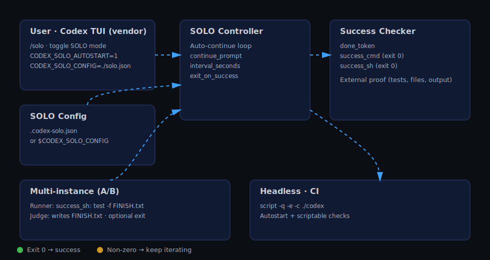

आर्किटेक्चर और डिज़ाइन
=======================

यह दस्तावेज़ बताता है कि यह रेपो Codex को vendor करके व्यावहारिक SOLO मोड कैसे जोड़ता है, और सफलता जाँच व CI/हेडलैस उपयोग कैसे काम करता है।

डायग्राम

सीक्वेंस (Sequence)

लक्ष्य
- अपस्ट्रीम से न्यूनतम डिफ (vendor; घुसपैठ वाले बदलाव नहीं)
- अनुमान के बजाय लूप के साथ स्वचालित प्रगति
- सफलता को “प्रमाण” से परिभाषित करना (exit 0, फ़ाइल/आउटपुट/टेस्ट) न कि शब्दों से

घटक
- Codex TUI (vendor): इंटरैक्टिव CLI/कंसोल
- SOLO कंट्रोलर: auto‑continue लूप (`continue_prompt`, `interval_seconds`, `exit_on_success`)
- सफलता जाँच: `done_token` या scriptable `success_cmd` / `success_sh` (exit 0)
- कॉन्फ़िग लोडर: `.codex-solo.json` या `CODEX_SOLO_CONFIG`
- मल्टी‑इंस्टेंस A/B: Runner (प्रमाण देखे) / Judge (प्रमाण लिखे)
- हेडलेस/CI (निरंतर एकीकरण): छद्म‑टर्मिनल (pseudo‑TTY) + autostart + scriptable जाँच

डेटा फ्लो
1) उपयोगकर्ता TUI में `/solo` से सक्रिय करे या env/फाइल से autostart
2) कंट्रोलर छोटे “continue” संदेश भेजे; वैकल्पिक अंतराल
3) हर राउंड के बाद सफलता जाँच: टोकन मैच या बाहरी कमांड/शेल exit 0
4) सफलता पर वैकल्पिक बाहर निकलना; अन्यथा जारी

डिज़ाइन नोट्स
- सटीक प्रमाण हेतु `success_sh` को प्राथमिकता दें (रिपोर्ट grep, JSON/फाइल जाँच)
- `done_token` को खाली स्ट्रिंग करने से उसे निष्क्रिय किया जा सकता है
- A/B में अलग `CODEX_SOLO_CONFIG` से कॉन्फ़िग अलग रखें
- हेडलेस में लॉग संक्षिप्त रखें; जाँच छोटी और सटीक (अनावश्यक शोर न हो)

विस्तार
- नई जाँच रेसिपी (जैसे JSONPath, HTTP checks)
- CI में रिलीज़ से `codex` बायनरी डाउनलोड कर सकते हैं
